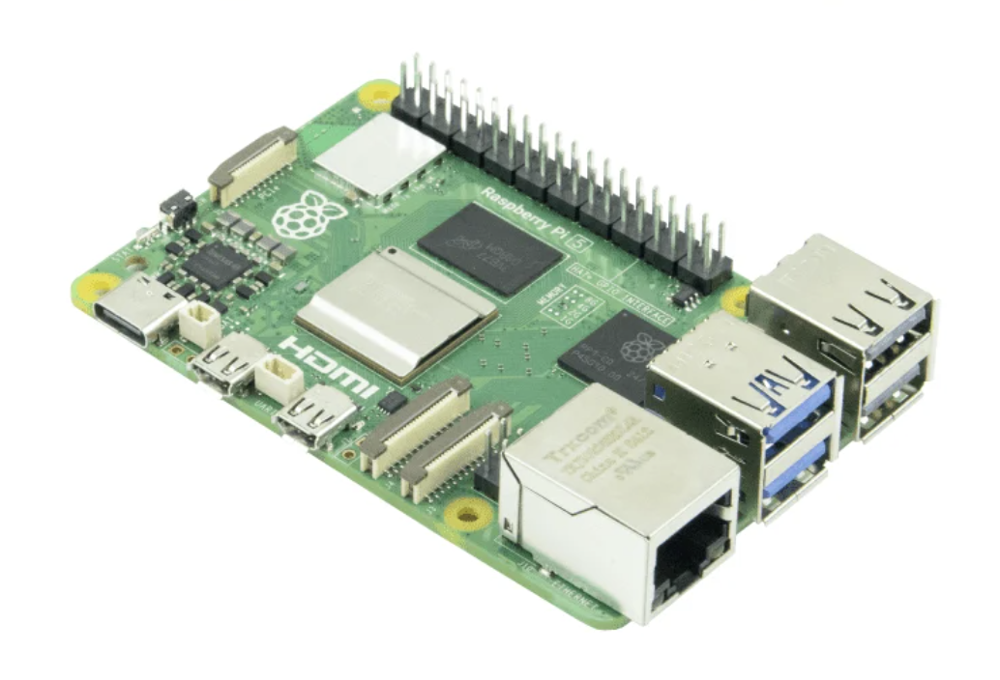
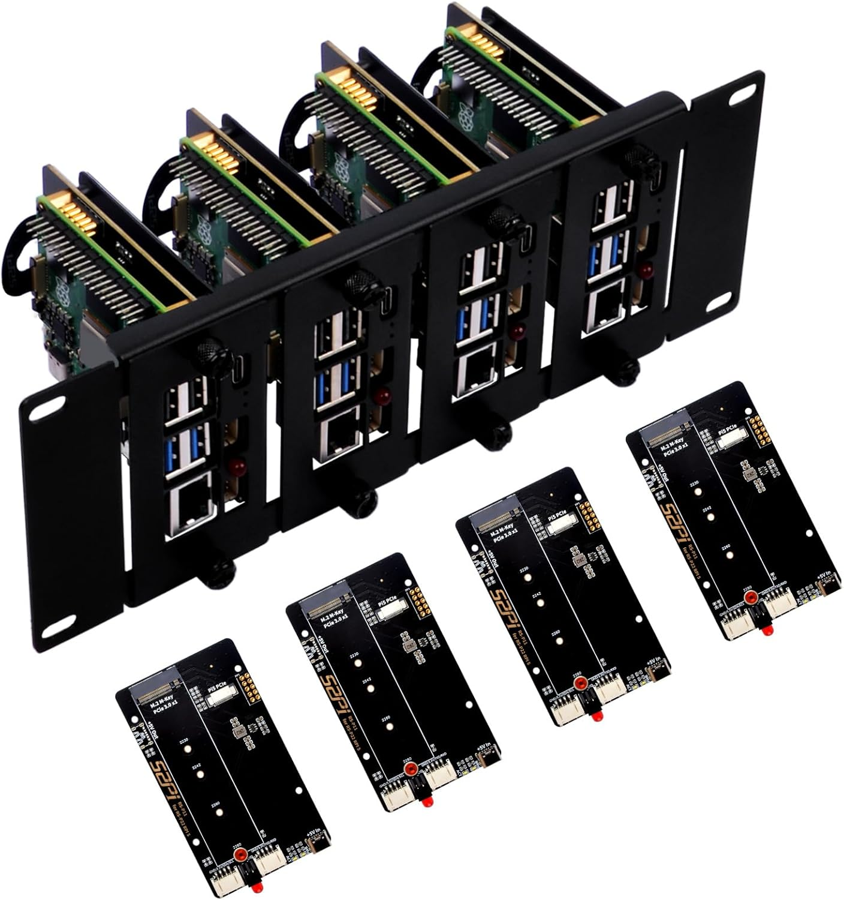
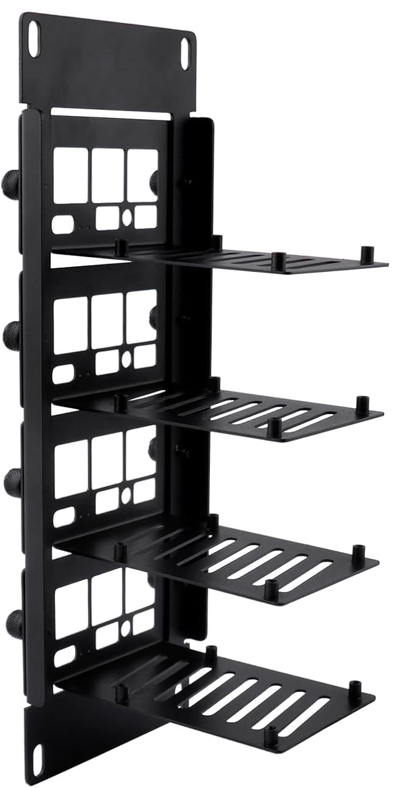
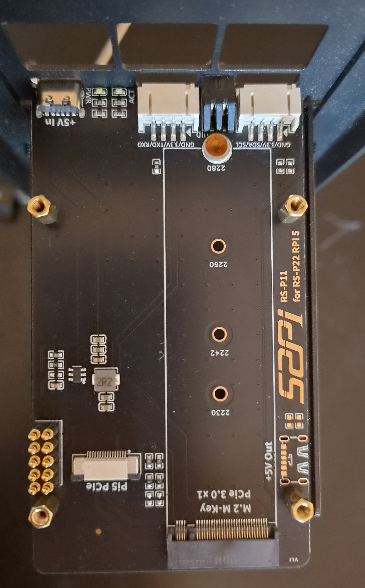
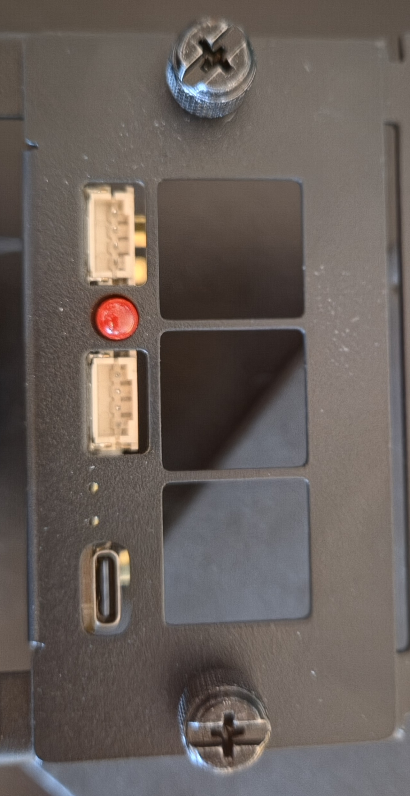
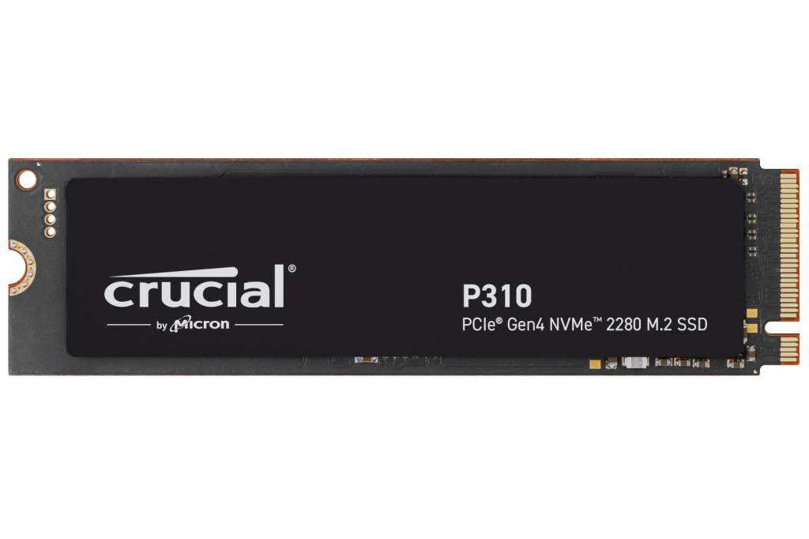
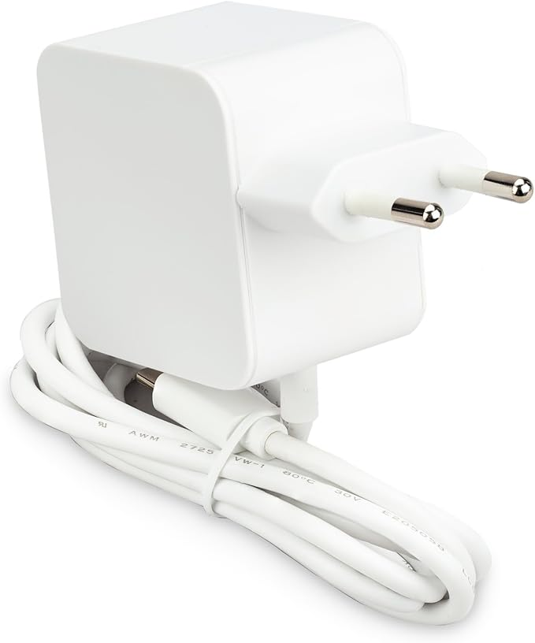
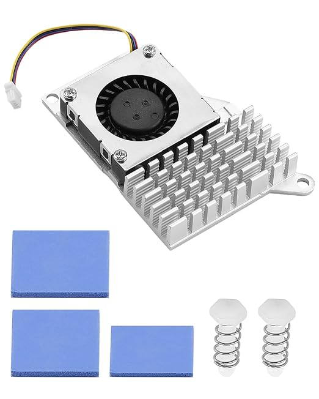

# Homelab Cluster — Hardware Choices

3-node Raspberry Pi 5 Kubernetes cluster, all nodes control-plane (HA, every node runs etcd). Mounted in a 10" 2U
half-rack mount, NVMe-booted.

## Bill of materials

| Component  | Choice                                                     | Qty                   | OEM / reference                                                          |
|------------|------------------------------------------------------------|-----------------------|--------------------------------------------------------------------------|
| SBC        | Raspberry Pi 5, 8GB                                        | 3 (4th slot reserved) | [raspberrypi.com](https://www.raspberrypi.com/products/raspberry-pi-5/)  |
| Rack mount | GeeekPi **DP-0046** — 10" 2U mount + 4× RS-P11 NVMe boards | 1 (kit)               | [wiki.deskpi.com](https://wiki.deskpi.com/rackmate_accessories_3/)       |
| NVMe board | 52Pi **RS-P11** bottom board (4× incl. in the DP-0046 kit) | 4                     | [wiki.52pi.com](https://wiki.52pi.com/index.php?title=EP-0234)           |
| SSD        | Crucial P310 1TB 2280, bare PCB (CT1000P310SSD8)           | 3                     | [crucial.com](https://eu.crucial.com/ssd/p310/ct1000p310ssd8)            |
| PSU        | Raspberry Pi 27W USB-C PD (5.1V/5A)                        | 3                     | [raspberrypi.com](https://www.raspberrypi.com/products/27w-power-supply/) |
| Cooling    | Pi 5 active cooler (fan + alu heatsink)                    | 3                     | [raspberrypi.com](https://www.raspberrypi.com/products/active-cooler/)   |

---

## Compute — 3× Raspberry Pi 5 (8GB)

- **8GB** for headroom: control-plane + etcd + actual workloads on each node.
- **3 nodes** = odd etcd quorum, tolerates 1 failure. A 4th board exists but stays out for now — 4 control-plane nodes
  give the *same* fault tolerance as 3 while adding etcd write latency.
- 4th rack slot left open for a future non-cp worker (worker doesn't touch quorum).

## Rack mount — GeeekPi DP-0046 (10" 2U)

- GeeekPi **DP-0046**: a 10" **2U rack mount with PCIe NVMe boards** for Pi 5/4B. Same product DeskPi documents as the
  "Rackmate 2U Rack Mount with PCIe NVMe Board" (GeeekPi / DeskPi are sister brands).
- Holds up to **4 Pi 5 boards** and slots into a standard 10" cabinet; I already had a 10" rack at home, so the 10"
  2U was the natural choice.
- The kit **bundles 4× RS-P11 bottom NVMe boards** (one per bay), so NVMe per node without buying separate HATs.

## NVMe — bundled RS-P11 boards

The bundled NVMe board is the 52Pi **RS-P11** ([EP-0234](https://wiki.52pi.com/index.php?title=EP-0234)), a
**bottom-mount** cluster board, which sits *under* the Pi.

- **M.2 M-key, 2230–2280; using 2280.**
- **PCIe Gen2 by default.** Pi 5 PCIe is a single Gen2 lane (~450 MB/s). Gen3 is forceable (`dtparam=pciex1_gen=3`,
  ~800–900 MB/s) but officially unsupported and risks AER errors in a tight thermal box. We expect light IO, so Gen2 is
  plenty, and we won't risk Gen3 instability.
- **Power — fed from the Pi, not the board.** Each board is powered *indirectly*: the PD brick goes into the **Pi's own
  (side-facing) USB-C port**, and because both USB-C inputs sit on a single shared 5V rail (over the GPIO pins), that
  power backfeeds *down* into the RS-P11 and runs the NVMe from there. We originally planned the reverse — brick into
  the RS-P11's front port, which is far easier to reach at the front of the rack — but switched to the Pi's port for
  power reasons (the front port is non-PD and can't supply the full 5A we want for future drives; see the Power section
  below). **Never feed both the Pi's USB-C and the RS-P11's USB-C at the same time** — there is no backfeed protection,
  and two sources fighting on the rail will damage the hardware (52Pi documents this caution explicitly). After wiring
  it this way, confirm the NVMe still enumerates: `lsblk` / `dmesg | grep nvme` (it should — same rail).

## Storage — Crucial P310 1TB (without heat spreader)

Model **CT1000P310SSD8**, M.2 2280, ~**220 TBW** ~ 1700.00 SEK (~ $180 USD) (NAND prices are still elevated post-2024
shortage).

- **Endurance is the binding spec, not speed.** All nodes are control-plane, so every node runs etcd with constant
  fsync/WAL writes. TBW is what matters here.
- **Rejected Crucial E100 (~80 TBW):** fine for light IO, but weak once *every* node is doing fsync-heavy etcd writes
  around the clock. P310's 220 TBW removes the question for little extra.
- **Skipped Gen4/Gen5:** the Pi throttles them to its Gen2 lane anyway, and Gen5 in particular runs hot in a stacked
  enclosure. Gen3 is possible, but we don't need the speed and it risks instability, so Gen2 is fine for us.
- **Heat spreader had to come off.** I first bought one piece of the CT1000P310SSD5 model, which is the same SSD but
  came with an attached heat-sink. But even at 2.3 mm, the spreader didn't clear between the RS-P11 board and the Pi
  mounted above it, so I pried off the heat sink and let the drive run bare. Probably fine thermally: since we don't
  expect sustained heavy IO, and it's throttled to the Pi's Gen2 lane anyway. The P310 will barely warm up. For the
  other two drives, I went straight for the same model without the spreader (CT1000P310SSD8) to avoid the hassle of
  peeling off the spreader on each.

## Power — 3× Raspberry Pi 27W USB-C PD

One PSU per Pi, plugged **directly into the Pi's own USB-C port**. No DC distribution board — simple and independent.

- **PD straight into the Pi gives the full 5A, automatically.** The official Raspberry Pi 27W brick (5.1V / 5A) is a
  genuine USB-PD supply. Plugged into the Pi's own USB-C port, it negotiates the full 5A / ~25W over PD by itself, and
  the firmware then raises the downstream USB cap from 600mA to 1.6A on its own — no EEPROM tweak or `config.txt`
  override needed. The Pi's USB-C is the *only* connector in the stack that speaks PD, so this only works with the brick
  going into the Pi directly (not via the RS-P11's passthrough).
- **Why not the RS-P11's front port (which would have been easier to reach).** Its front USB-C is a dumb 5V passthrough
  with no PD negotiation. Without PD, USB-C tops out at whatever plain Type-C signalling allows — **3A (15W) at best,
  possibly only 1.5A** — and the board's *actual* deliverable ceiling isn't documented anywhere, so we can't rely on
  it. It's enough to run a node as it stands today (budget below), but it leaves no headroom, and headroom is the whole
  point (HDDs, below).
- **What current is available, and where** (with PD into the Pi):
  - **Total from the brick:** 5A / ~25W, shared across the whole stack.
  - **Pi compute (SoC + RAM + fan):** ~1.8–2A under full load.
  - **NVMe (PCIe):** ~0.6–1A, off the board's 5V rail — *not* counted against the USB cap.
  - **The four USB-A ports:** hard-capped at **1.6A / 8W combined**. PD lifts this from 600mA to 1.6A; nothing lifts it
    past 1.6A. This is the ceiling for anything hung off USB.
- **Realistic full-load draw as configured (no HDD yet):** CPU all-core + NVMe IO + saturated gigabit + fan at 100% ≈
  **13–15W (~2.6–2.9A)**, transient peaks brushing ~3A. That only just fits a 3A supply — the second reason the non-PD
  front port is a poor bet under load.
- **Headroom for 2.5" HDDs — the reason we want the full 5A.** The plan is to hang a bus-powered 2.5" HDD off each Pi
  later. A 2.5" drive draws ~4–5W (most of it on spin-up), pushing a node to **~18–20W (~3.5–4A)** — past what the ~3A
  front port could deliver, but comfortably inside the genuine 5A from PD. The USB cap still applies: one bus-powered
  2.5" drive (~5W) fits the 1.6A / 8W USB budget; a *second* one per node would blow past 8W and need its own power
  (powered hub / externally-powered enclosure), regardless of how much the input brick can supply.
- **Downside — the Pi's USB-C is side-facing and buried once racked.** Reaching it needs more depth / cable slack in
  the rack than the front port would have. Accepted trade-off; we'll route for it.
- **Switched to the official Raspberry Pi brick — the GeeekPi one was too wide.** We started on the GeeekPi 27W, but its
  body was too wide to seat several side-by-side in the rack. The official Raspberry Pi 27W (same 5.1V/5A PD spec) is
  narrow enough to fit three in a row — and since we're now cabling to the Pi's side-facing port, a compact brick
  matters even more.

## Cooling — Pi 5 active cooler + thermal pads

Blower-style active cooler (aluminium heatsink + PWM fan), one per board. Kit included **3 thermal pads**. Placement:

- **CPU — BCM2712 SoC: 1 pad.** Primary contact, the tallest die.
- **RP1 I/O chip (southbridge): 2 pads stacked.** RP1 sits *lower* than the SoC, so a single pad left the cooler
  rocking/not seating flat. Doubling the pad fills the height gap and levels the cooler so both chips get firm contact.
- **No pads on the remaining chips (e.g. PMIC).** Two reasons: only 3 pads in the kit, and those chips run *warm, not
  hot* — they're fine bare.

Why RP1 is the one that needs the second contact: it's the southbridge carrying USB / Ethernet / GPIO / PCIe I/O, the
second-warmest chip after the SoC, and the cooler's intended secondary contact point.
