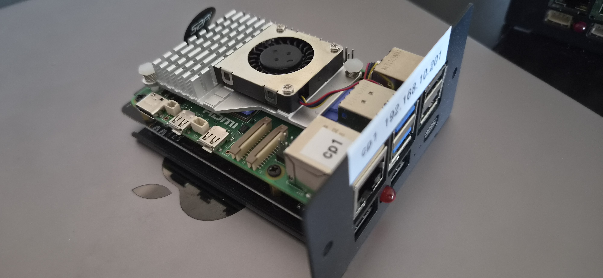
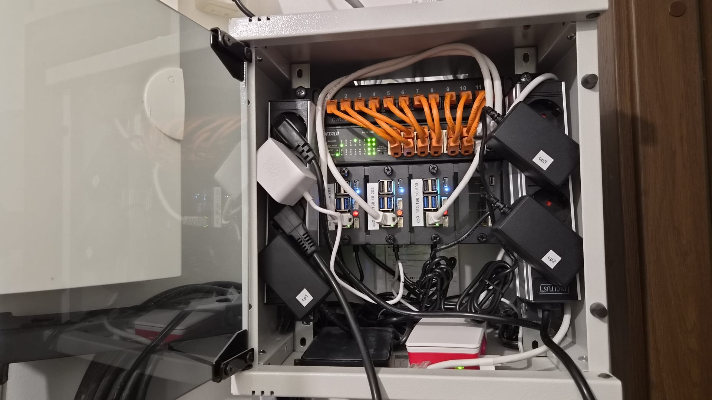

# Homelab cluster hardware choices

3-node Raspberry Pi 5 Kubernetes cluster, all nodes control-plane (HA, every node runs etcd). Mounted in a 10" 2U
half-rack mount, NVMe-booted.

## Bill of materials

| Component  | Choice                                                 | Qty                   | OEM / reference                                                           |
|------------|--------------------------------------------------------|-----------------------|---------------------------------------------------------------------------|
| SBC        | Raspberry Pi 5, 8GB                                    | 3 (4th slot reserved) | [raspberrypi.com](https://www.raspberrypi.com/products/raspberry-pi-5/)   |
| Rack mount | GeeekPi DP-0046, 10" 2U mount + 4x RS-P11 NVMe boards  | 1 (kit)               | [wiki.deskpi.com](https://wiki.deskpi.com/rackmate_accessories_3/)        |
| NVMe board | 52Pi RS-P11 bottom board (4x incl. in the DP-0046 kit) | 4                     | [wiki.52pi.com](https://wiki.52pi.com/index.php?title=EP-0234)            |
| SSD        | Crucial P310 1TB 2280, bare PCB (CT1000P310SSD8)       | 3                     | [crucial.com](https://eu.crucial.com/ssd/p310/ct1000p310ssd8)             |
| PSU        | Raspberry Pi 27W USB-C PD (5.1V/5A)                    | 3                     | [raspberrypi.com](https://www.raspberrypi.com/products/27w-power-supply/) |
| Cooling    | Pi 5 active cooler (fan + alu heatsink)                | 3                     | [raspberrypi.com](https://www.raspberrypi.com/products/active-cooler/)    |

---

## Compute: 3x Raspberry Pi 5 (8GB)

- 8GB for headroom: control-plane + etcd + actual workloads on each node.
- 3 nodes = odd etcd quorum, tolerates 1 failure.
- A 4th board exists but stays out for now. I'll add that later as a non-cp (worker) node.

## Rack mount: GeeekPi DP-0046 (10" 2U)

- GeeekPi DP-0046: a 10" 2U rack mount with PCIe NVMe boards for Pi 5/4B. Same product DeskPi documents as the
  "Rackmate 2U Rack Mount with PCIe NVMe Board" (GeeekPi / DeskPi are sister brands).
- Holds up to 4 Pi 5 boards and slots into a standard 10" cabinet; I already had a 10" rack at home, so the 10"
  2U was the natural choice.
- The kit bundles 4x RS-P11 bottom NVMe boards (one per bay), so NVMe per node without buying separate HATs.

## NVMe: bundled RS-P11 boards

The bundled NVMe board is the 52Pi RS-P11 ([EP-0234](https://wiki.52pi.com/index.php?title=EP-0234)), a
bottom-mount cluster board that sits under the Pi.

- M.2 M-key, 2230-2280; (we are using 2280).
- PCIe Gen2 by default. Pi 5 PCIe is a single Gen2 lane (~450 MB/s). Gen3 is forceable (`dtparam=pciex1_gen=3`,
  ~800-900 MB/s) but officially unsupported and risks AER errors in a tight thermal box. We expect light IO, so Gen2 is
  plenty, and we won't risk Gen3 instability.
- The PD brick goes into the Pi's own (side-facing) USB-C port, and because both USB-C inputs sit on a single shared 5V
  rail (over the GPIO pins), that power feeds down into the RS-P11 and runs the NVMe from there.
    - The NVMe boards have a convenient front-facing USB-C power port. We originally planned to use that one, to power
      the NVMe board, which would then backfeed the power into the Pi, but switched to the Pi's port for power reasons:
        - the front port is non-PD and can't supply the full 5A, which we might need in future if we want to connect
          spinning HDDs to the Pis via USB3 (without dedicated power source for the drives).

## Storage: Crucial P310 1TB (without heat spreader)

Model CT1000P310SSD8, M.2 2280, ~220 TBW, ~1700 SEK (~$180 USD) (NAND prices still elevated post-2024 shortage).

- Endurance is the binding spec, not speed. All nodes are control-plane, so every node runs etcd with constant
  fsync/WAL writes. TBW is what matters here.
- Rejected Crucial E100 (~80 TBW): fine for light IO, but weak once every node is doing fsync-heavy etcd writes
  around the clock. P310's 220 TBW removes the question for little extra.
- PCIe Gen3 is possible, but we don't need the speed, and it risks instability, so Gen2 is fine for us.
- I first bought one CT1000P310SSD5, the same SSD but with an attached heat-sink. The spreader didn't clear between the
  RS-P11 board and the Pi mounted above it, so I pried it off. We don't expect sustained heavy IO, and it's throttled to
  the Pi's Gen2 lane anyway, so the P310 will barely warm up. For the other two drives I went straight for the
  no-spreader model (CT1000P310SSD8) to skip the peeling.

## Power: 3x 27W USB-C PD

One 27W USB-C PSU per Pi, plugged directly into the Pi's own USB-C port.

- PD straight into the Pi gives the full 5A, automatically. Plugged into the Pi's own USB-C port it negotiates the full
  5A / ~25W over PD by itself, and the firmware then raises the downstream USB cap from 600mA to 1.6A on its own, no
  EEPROM tweak or `config.txt` override needed.
- Power calculation:
    - Total from the brick: 5A / ~25W, shared across the whole stack.
    - Pi compute (SoC + RAM + fan): ~1.8-2A under full load.
    - NVMe (PCIe): ~0.6-1A, off the board's 5V rail, not counted against the USB cap.
    - The four USB-A ports: hard-capped at 1.6A / 8W (all 4 ports combined).
- Headroom for 2.5" HDDs, which is the reason we want the full 5A. The plan is to hang a bus-powered 2.5" HDD off each
  Pi later. A 2.5" drive draws ~4-5W (most of it on spin-up). Addin a second drive might push the Pi's USB cap over
  1.6A, so we would need an external power source for additional hdds, but that's not in the plan anyway.
- Downside: the Pi's USB-C is side-facing and harder to reach.

## Cooling: Pi 5 active cooler + thermal pads

Blower-style active cooler (aluminium heatsink + PWM fan), one per board. Kit included 3 thermal pads. Placement:

- CPU (BCM2712 SoC): 1 pad. Primary contact, the tallest die.
- RP1 I/O chip (southbridge): 2 thermal pads stacked. RP1 sits lower than the SoC, so a single pad left the cooler
  rocking/not seating flat. Doubling the pad fills the height gap and levels the cooler so both chips get firm contact.
- No pads on the remaining chips (e.g. PMIC). Two reasons: only 3 pads in the kit, and those chips run warm, not
  hot, so they're fine bare.

Why RP1 is the one that needs the second contact: it's the southbridge carrying USB / Ethernet / GPIO / PCIe I/O, the
second-warmest chip after the SoC.

## End result (assembled)

Granted, the rack still needs a bit of better cable management, but that's a problem for future-me.
