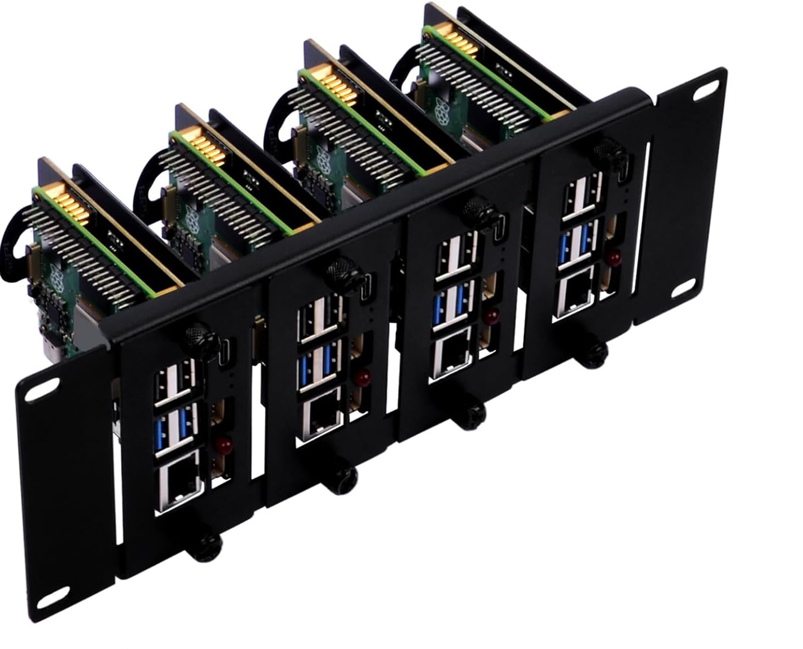
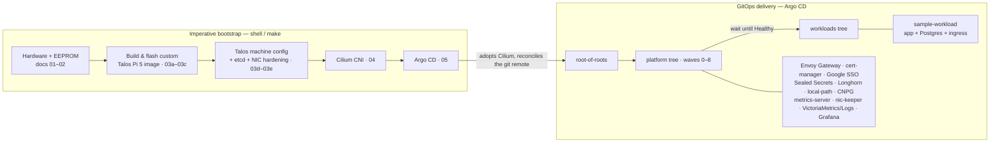

# pi5-k8s-cluster

**A 3× Raspberry Pi 5 Kubernetes cluster on [Talos Linux](https://www.talos.dev/), networked by
[Cilium](https://cilium.io/), delivered by [Argo CD](https://argo-cd.readthedocs.io/).**


<p align="center">
  
</p>

> This is a personal homelab, documented end-to-end so you can follow it, learn from it, or adapt it to your
> own hardware. It's not a one-click template — the OS image, network, domains and sizing are specific to my
> build — but the repo is a **numbered, ordered runbook**: run the steps in sequence and you get a cluster.
> See **[Make it your own](#make-it-your-own)** for what an adopter has to change.

## Contents

- [Overview](#overview)
- [The stack](#the-stack)
- [Hardware](#hardware)
- [Architecture](#architecture)
- [Repository layout](#repository-layout)
- [Getting started](#getting-started)
- [Make it your own](#make-it-your-own)
- [Day-2 operations](#day-2-operations)
- [Troubleshooting](#troubleshooting)
- [Documentation](#documentation)
- [License](#license) · [Credits](#credits)

## Overview

Three Raspberry Pi 5s, **every node a control-plane node** (HA etcd, workloads co-located), booting Talos Linux off
NVMe. Talos has no official Raspberry Pi 5 image, so this repo **builds its own**. A custom installer with a
Raspberry Pi kernel (4K pages, for Longhorn/XFS) and the extensions the cluster needs.

The bring-up has a imperative shell steps do only what must exist **before GitOps**:

- flash Talos onto NVMe drive
- bootstrap etcd
- install Cilium CNI
- install Argo CD

and then **everything else is GitOps**. Argo CD reconciles this repo's `argo_apps/` tree and delivers the whole
platform (ingress, TLS, SSO, storage, databases, monitoring) and the workloads on top of it.

Config lives in exactly one place: a gitignored `.env` (copied from `.env.example`). It holds every tunable value and
secret; nothing is hardcoded in scripts, and every app is a thin Helm wrapper chart that pins its upstream version. The
repo doubles as its own decision record: `docs/01`–`10` explain *why* each choice was made.

## The stack

Everything after `04`/`05` is delivered by Argo CD as a thin wrapper chart. Versions are pinned per chart (`Chart.yaml`)
and in `.env`. Those files are the source of truth. The roles are:

| Layer             | Component                      | Role                                                                                                         |
|-------------------|--------------------------------|--------------------------------------------------------------------------------------------------------------|
| **OS**            | Talos Linux                    | Immutable, API-driven Kubernetes OS. Custom Pi 5 NVMe image built in-repo (step 03).                         |
| **Network**       | Cilium                         | CNI + kube-proxy replacement, LB-IPAM + L2 announcements (LoadBalancer IPs), node-to-node WireGuard, Hubble. |
| **GitOps**        | Argo CD                        | Delivery engine; self-manages after bootstrap. Two-tree app-of-apps (platform & workloads).                  |
| **Ingress**       | Envoy Gateway                  | Gateway API data plane; one Envoy on a single pinned LoadBalancer IP.                                        |
| **TLS**           | cert-manager                   | Let's Encrypt certificates via ClusterIssuers.                                                               |
| **Auth**          | Google SSO                     | Central OIDC per domain (Envoy `SecurityPolicy`, per-host email-address allowlists).                         |
| **Secrets**       | Sealed Secrets                 | Encrypted secrets committed to git.                                                                          |
| **Storage**       | Longhorn                       | Replicated block storage (default StorageClass), for workloads with persistent file-storage (e.g. redis?)    |
| **Storage**       | local-path-provisioner         | Node-local volumes (backs Postgres, which handles its own replication).                                      |
| **Database**      | CloudNativePG                  | Kubernetes-native PostgreSQL operator.                                                                       |
| **Metrics API**   | metrics-server                 | `metrics.k8s.io` for `kubectl top` / HPA.                                                                    |
| **NIC**           | nic-keeper                     | Custom DaemonSet that keeps the flaky Pi 5 `macb` NIC/VIP healthy.                                           |
| **Observability** | VictoriaMetrics + VictoriaLogs | PromQL-compatible Metrics & logs backend (chosen over Prometheus/Mimir + Loki for 8 GB nodes).               |
| **Observability** | Grafana                        | Dashboards + alerting (provisioned as code, otherwise no persistence layer).                                 |
| **Workload**      | sample-workload                | Demo app + its own CNPG Postgres + open/SSO ingress: the template for other "real" workloads/apps.           |

Two shared charts under `lib/helm/` are consumed as dependencies:

- `ingress`: a simple wrapper around Gateway/HTTPRoute/Certificate (allows ingress-ing)
- `pg-cluster`: a CNPG Postgres wrapper (makes CNPG easier to consume in a GitOps repo)

## Hardware

3× Raspberry Pi 5 (8 GB), all control-plane, NVMe-booted, in a 10" 2U half-rack (4th bay reserved for a future 4GB node
that I may add as a worker). See **[docs/01_hardware.md](docs/01_hardware.md)**:

| Component    | Choice                                       | Qty                  |
|--------------|----------------------------------------------|----------------------|
| SBC          | Raspberry Pi 5, 8 GB                         | 3                    |
| Rack         | GeeekPi DP-0046 (10" 2U)                     | 1                    |
| NVMe carrier | 52Pi RS-P11 boards                           | 4 (1 unused for now) |
| SSD          | Crucial P310 1 TB (CT1000P310SSD8, ~220 TBW) | 3                    |
| Power        | 27 W USB-C PD (5.1 V / 5 A)                  | 3                    |
| Cooling      | Pi 5 active cooler + aluminum heat sink      | 3                    |

Why these: all-control-plane means constant fsync-heavy etcd writes, so endurance-focused SSDs; 8 GB memory for headroom
co-locating etcd + workloads; PD into the Pi's own USB-C port for the full 5 A.

## Architecture

The imperative bootstrap exists only to reach Argo CD. From there, git is the source of truth. The platform tree must go
fully "Healthy" before the workloads tree is created, so nothing ever reconciles against missing CRDs on a cold boot.



## Repository layout

```
.
├── Makefile            # thin dispatcher over lib/shell — run `make help`
├── .env.example        # template for config & secrets — copy to .env
├── .env                # single source of truth for config & secrets
├── docs/               # the numbered runbook + decision records (01–10)
├── lib/
│   ├── shell/          # bootstrap shell scripts & helpers
│   └── helm/           # shared charts: ingress (library) & pg-cluster (CNPG wrapper)
├── argo_apps/          # everything Argo CD delivers (two-tree GitOps)
│   ├── root.yaml       #   root-of-roots (applied once by the 05 script)
│   ├── roots/          #   0_platform → 1_workloads
│   ├── platform/{apps,charts}/
│   └── workloads/{apps,charts}/
└── secrets/            # gitignored: talos certs, talosconfig, kubeconfig, sealed key
```

The `NN_` prefixes constitute the sync-wave, i.e. the order in which they are bootstrapped by Argo.

## Getting started

**Disclaimer**: I only ever ran this on MacOS. So you might need some tweaks for Linux or WSL. The scripts assume a
bash/zsh shell, GNU `make`, and a POSIX-y environment.

**On your machine**:

- `docker` (with host networking), `git`, `kubectl`, `helm`, `yq`, `kubeseal`.
- Building the Talos image (step 03a) also needs `go`, `zstd`, `xz`, `jq`, `curl`.
- You do **not** need a native `talosctl`. It runs dockerized via `make talosctl` (because the official MacOS version
  is completely kaputt, no matter if from homebrew or from source)

Alternatively to `make bootstrap-cluster`, tou can run steps 04ff in runbook order. Every target maps to a script in
`lib/shell/`. `make help` lists them all.

```bash
# 0. Assemble the hardware (docs/01) and flash each Pi's EEPROM boot order (insert microSD into your laptop)
make build-eeprom-card              # 02 — write the EEPROM boot config to a microSD card (same card for all nodes)

# --> Now insert SD card into each pi one-by-one, power on, wait for LED to flash green rapidly, which means flashing is
#     done, then power off and remove the SD card.

# 1. Configure — the single source of truth
cp .env.example .env                # then edit: node IPs, domains, versions, secrets. Go over everything, to be sure.

# 2. Build the custom Talos image
make build-talos-image              # 03a — build (+ optionally publish) Talos OS image w/ custom kernel and extensions

# 3. Flash the NVMe drives: Connect each NVMe to your laptop (e.g. via some USB adapter) and run, respectively:
make flash-talos-nvme               # 03b — write to each NVMe (repeat per drive)

# 4. Verify the nodes boot into Talos maintenance mode
make verify-talos-boot              # 03c — confirm each node boots into maintenance mode

# 5. Bootstrap the cluster
make bootstrap-cluster              # config + etcd + Cilium + Argo CD + seed secrets

# 6. Verify
make check-health                   # Talos cluster health
eval "$(make print-kubeconfig)"     # point kubectl at the cluster
kubectl get applications -n argocd  # watch Argo CD deliver the platform, then workloads
```

Full step-by-step reasoning and verification for each phase is in [the docs](#documentation).

## Make it your own

This is my exact build; to run it on your gear, edit **`.env`** (copied from `.env.example`) and expect to change at
least:

- **Topology & network**: `CLUSTER_NODES` (hostnames+IPs), `CLUSTER_VIP`, `LB_RANGE_START`/`LB_RANGE_STOP`.
  Reserve each node IP in your router; keep the VIP and LB pool on the nodes' L2, outside your DHCP range.
    - To reserve your node IPs, connect the PIs to your network and check in your router which MAC addresses the
      connected PIs have. Then reserve the intended IP addresses for those MAC addresses in your router's DHCP settings.
- **Domains & TLS**: `BASE_DOMAIN`, `LE_EMAIL`, and your Google OAuth app (`GOOGLE_SSO_CLIENT_ID` +
  `GOOGLE_SSO_CLIENT_SECRET`). Add each exposed hostname to the allowlists in `argo_apps/platform/charts/04_google_sso`.
- **Git remote**: `REPO_URL` **must** equal your forked `repoURL` committed across `argo_apps/`. Argo CD reconciles
  the pushed remote, not your working tree, so **commit + push before you expect a sync**.
- **Registry**: `GHCR_USER` and, if you publish the installer image or use private images, the GHCR tokens.
- **Secrets**: every secret in `.env` is optional; leaving one empty **disables the feature it enables**
  (Google SSO, private GHCR pulls, talos upgrades via pushed images, Argo CD private-repo access, Grafana email).

**Hardware caveats worth knowing before you commit:** the build assumes Raspberry Pi 5 + NVMe with **all nodes as
control-plane**, and a **custom-built kernel** (4K pages) for Longhorn/XFS compatibility. So it is not drop-in for other
SBCs or the stock Talos image. Start from [docs/03](docs/03_operating_system.md) if your hardware differs.

## Day-2 operations

| Task                      | Command                                                                          | Notes                                                                                                               |
|---------------------------|----------------------------------------------------------------------------------|---------------------------------------------------------------------------------------------------------------------|
| Upgrade Talos             | `make upgrade-talos`                                                             | Rolling A/B in-place to the pinned installer (03f) (bump `TALOS_VERSION` in .env)                                   |
| Upgrade Kubernetes        | `make upgrade-k8s`                                                               | Rolling, no reboot (03g). (Bump `KUBERNETES_VERSION` in `.env`)                                                     |
| Rebuild a running cluster | `make rebuild-cluster`                                                           | Wipes + rebuilds end-to-end, restores the sealed-secret key. Destructive to the persistence layer (cnpg, longhorn). |
| Reset all nodes           | `make reset-cluster`                                                             | Wipes back to maintenance mode. Destructive to the persistence layer (cnpg, longhorn).                              |
| Inspect                   | `make check-health` · `make talosctl <args>` · `eval "$(make print-kubeconfig)"` | Read-only.                                                                                                          |

## Troubleshooting

- **`talosctl` misbehaves on macOS**: use the dockerized `make talosctl <args>`. A native client isn't
  required ([docs/03](docs/03_operating_system.md)).
- **Nodes are `NotReady` after Talos bring-up**: Expected until the Cilium CNI lands (`make install-cilium`, step 04).
- **An Argo CD app is `OutOfSync` / "path does not exist"**: you didn't git-push. Commit + push `argo_apps/**`
  including any `Chart.lock` ([docs/05](docs/05_gitops.md)).
- **LoadBalancer IP stuck `<pending>`**: the Cilium LB pool must be on the nodes' L2 and avoid the DHCP range and the
  VIP ([docs/04](docs/04_networking.md)).
- **Intermittent NIC drops on a Pi 5**: the `macb` wedge; handled by NIC hardening (03e) + the `nic-keeper`
  DaemonSet ([docs/03](docs/03_operating_system.md)).

## Documentation

The narrative runbook — each doc holds the *why* behind a step, with verification commands:

| Doc                                                | Covers                                                                          |
|----------------------------------------------------|---------------------------------------------------------------------------------|
| [01_hardware](docs/01_hardware.md)                 | Bill of materials + the reasoning behind every part.                            |
| [02_raspi_eeprom](docs/02_raspi_eeprom.md)         | Flashing a common Pi 5 EEPROM boot config.                                      |
| [03_operating_system](docs/03_operating_system.md) | Talos: OS choice, the custom Pi 5 image build, cluster bring-up, NIC hardening. |
| [04_networking](docs/04_networking.md)             | Cilium as CNI + LoadBalancer + WireGuard (the last imperative infra).           |
| [05_gitops](docs/05_gitops.md)                     | Argo CD, the two-tree app-of-apps, sync-wave convention.                        |
| [06_secrets](docs/06_secrets.md)                   | Sealed Secrets + the master-key custody you can't lose.                         |
| [07_ingress](docs/07_ingress.md)                   | Envoy Gateway, cert-manager, Let's Encrypt, central Google SSO.                 |
| [08_storage](docs/08_storage.md)                   | Longhorn, local-path-provisioner, CloudNativePG.                                |
| [09_monitoring](docs/09_monitoring.md)             | VictoriaMetrics + VictoriaLogs, Grafana, metrics-server.                        |
| [10_sample_workload](docs/10_sample_workload.md)   | An end-to-end app + Postgres behind the Gateway.                                |


## Credits

Built on the work of the Talos/[Sidero](https://www.talos.dev/), [Cilium](https://cilium.io/),
[Argo CD](https://argo-cd.readthedocs.io/), [cert-manager](https://cert-manager.io/),
[Envoy Gateway](https://gateway.envoyproxy.io/), [Sealed Secrets](https://github.com/bitnami-labs/sealed-secrets),
[Longhorn](https://longhorn.io/), [CloudNativePG](https://cloudnative-pg.io/),
[VictoriaMetrics](https://victoriametrics.com/) and [Grafana](https://grafana.com/) communities. The custom
Pi 5 Talos image builds on [talos-rpi5/talos-builder](https://github.com/talos-rpi5)


## Todos

- disaster recovery exercise
- add a worker node (4th bay in the rack)
- check all logs/hubble for network policies in audit more that are dropping traffic that should be allowed
- dependabot/renovate 
- rewrite git history to remove secrets and email addresses and domains from past commits
- longhorn backups?
- ensure anti-affinity rules spread replica-pods for everything onto different nodes.
- compare .env and .env.example to make sure they are in sync / nothing is missing from either of them.
- compare to full argo app manifests for missing needed options.
- apply comment rules from claude.md to all yaml and other code files.
- read and shorten all md files.
- check cnpg backup accumulation, ensure it doesn't build up too much. consider extending WAL backup time.
